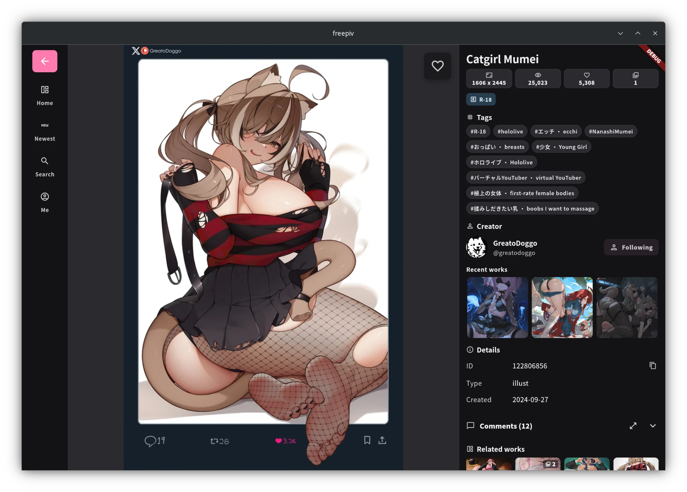
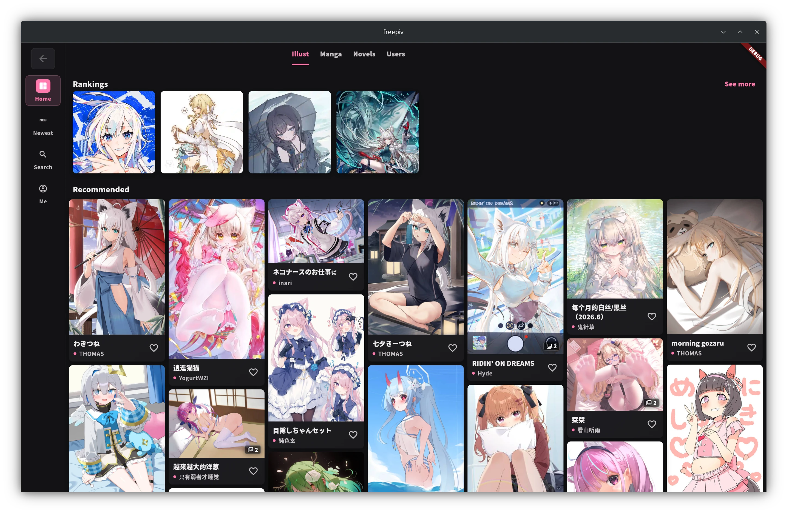
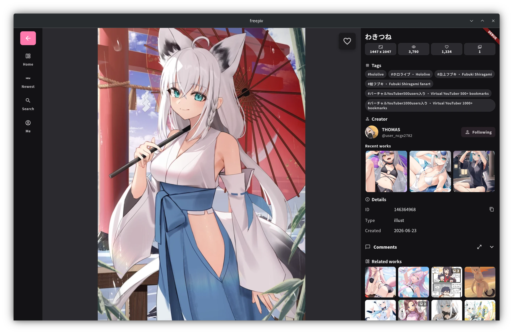
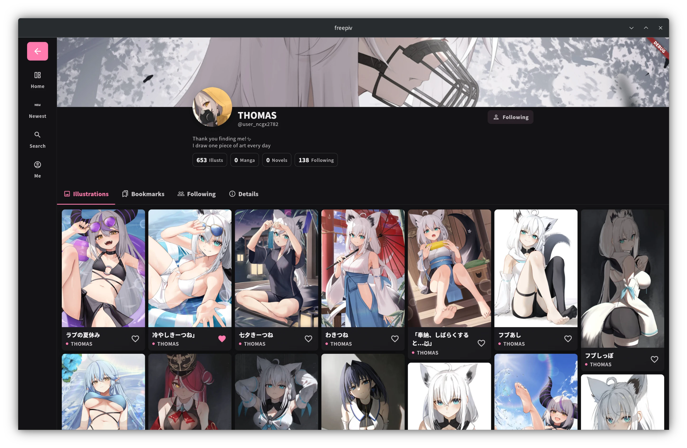
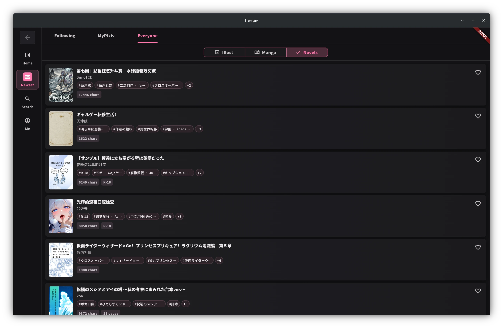

# freepiv

**A cross-platform third-party Pixiv app for Android, iOS, macOS, Windows, and Linux.**

FreePiv provides a smooth, modern, and cross-platform experience for browsing Pixiv content. It is built with Flutter and Rust, aiming to deliver a fast and
responsive Pixiv client across mobile and desktop platforms.

> freepiv is an unofficial third-party app and is not affiliated with or endorsed by Pixiv Inc.



---

## Features

* 🌐 **Cross-Platform Support**: Available on Android, iOS, macOS, Windows, and Linux.

- 🖥️ **Desktop-Optimized UI**: Provides a dedicated desktop layout and interaction experience for macOS, Windows, and Linux.

* 🖼️ **Illustration Browsing**: Browse Pixiv artworks with a clean and responsive interface.
* 🔍 **Search & Discovery**: Search artworks, novels, users, and tags.
* ❤️ **Bookmarks & Favorites**: Manage bookmarked works from your Pixiv account.
* 🚀 **High Performance**: Powered by Flutter and Rust for fast networking, parsing, and UI performance.
* 🧩 **Native Integration**: Uses `flutter_rust_bridge` to connect Flutter UI with Rust backend logic.

---

## Downloads

| Architecture | Windows                                                                               | Linux                                                                                                                                                                                                                                                                           | Android                                                                                           | macOS                                                                                           | iOS                                                                                    |
|--------------|---------------------------------------------------------------------------------------|---------------------------------------------------------------------------------------------------------------------------------------------------------------------------------------------------------------------------------------------------------------------------------|---------------------------------------------------------------------------------------------------|-------------------------------------------------------------------------------------------------|----------------------------------------------------------------------------------------|
| x86-64(x64)  | [zip](https://github.com/normalllll/freepiv/releases/latest/download/windows-x64.zip) | [tar.gz](https://github.com/normalllll/freepiv/releases/latest/download/linux-amd64.tar.gz) / [deb](https://github.com/normalllll/freepiv/releases/latest/download/freepiv_amd64.deb) / [rpm](https://github.com/normalllll/freepiv/releases/latest/download/freepiv_amd64.rpm) | [APK](https://github.com/normalllll/freepiv/releases/latest/download/app-x86_64-release.apk)      | [zip](https://github.com/normalllll/freepiv/releases/latest/download/macos-x86_64-nosigned.zip) |                                                                                        |
| ARM64        |                                                                                       |                                                                                                                                                                                                                                                                                 | [APK](https://github.com/normalllll/freepiv/releases/latest/download/app-arm64-v8a-release.apk)   | [zip](https://github.com/normalllll/freepiv/releases/latest/download/macos-arm64-nosigned.zip)  | [IPA](https://github.com/normalllll/freepiv/releases/latest/download/ios-nosigned.ipa) |
| ARM32        |                                                                                       |                                                                                                                                                                                                                                                                                 | [APK](https://github.com/normalllll/freepiv/releases/latest/download/app-armeabi-v7a-release.apk) |                                                                                                 |                                                                                        |
| Universal    |                                                                                       |                                                                                                                                                                                                                                                                                 | [APK](https://github.com/normalllll/freepiv/releases/latest/download/app-universal-release.apk)   |                                                                                                 |                                                                                        |

Visit the [releases page](https://github.com/normalllll/freepiv/releases) for more details on the latest versions.

---

## Getting Started

### Prerequisites

Before building or running FreePiv, install the following dependencies:

* [Flutter](https://flutter.dev/docs/get-started/install): A cross-platform UI toolkit.
* [Rust](https://www.rust-lang.org/tools/install): A performance-oriented systems programming language.
* [flutter_rust_bridge](https://github.com/fzyzcjy/flutter_rust_bridge): A tool for integrating Flutter and Rust.

### Installation

1. Install Flutter by following the [official Flutter guide](https://flutter.dev/docs/get-started/install).

2. Install Rust using `rustup` by following the [official Rust guide](https://www.rust-lang.org/tools/install).

3. Install `flutter_rust_bridge_codegen`:

   ```bash
   cargo install flutter_rust_bridge_codegen
   ```

4. Clone the repository:

   ```bash
   git clone https://github.com/normalllll/freepiv.git
   cd freepiv
   ```

5. Install Flutter dependencies:

   ```bash
   flutter pub get
   ```

6. Generate Flutter/Rust bridge code:

   ```bash
   flutter_rust_bridge_codegen generate --type-64bit-int --no-web
   ```

7. Generate Dart code:

   ```bash
   dart run build_runner build --delete-conflicting-outputs
   ```

8. Run the app:

   ```bash
   flutter run
   ```

---

## Development

When Rust bridge types or API definitions change, regenerate the bridge code:

```bash
flutter_rust_bridge_codegen generate --type-64bit-int --no-web
```

When Dart generated files need to be updated, run:

```bash
dart run build_runner build --delete-conflicting-outputs
```

For platform-specific builds, use Flutter's build commands:

```bash
flutter build apk
flutter build ios
flutter build macos
flutter build windows
flutter build linux
```

---

## Screenshots

### Desktop

|  |  |
|:------------------------------------------------------:|:------------------------------------------------------:|
|  |  |

### Mobile

|  |  |  |  |
|:----------------------------------------------------:|:----------------------------------------------------:|:----------------------------------------------------:|:----------------------------------------------------:|

---

## Contributing

Contributions are welcome!

* 🛠 **Bug Reports**: Found a bug? Open an issue on the [issue tracker](https://github.com/normalllll/freepiv/issues).
* 🌟 **Feature Requests**: Have an idea for a new feature? Feel free to propose it.
* 💻 **Code Contributions**: Pull requests are welcome.
* 🎨 **Design Contributions**: Icons, UI improvements, and visual design contributions are appreciated.

---

## Disclaimer

FreePiv is an unofficial third-party Pixiv client.

This project is not affiliated with, sponsored by, or endorsed by Pixiv Inc. Pixiv and related names, logos, and trademarks belong to their respective owners.

Users are responsible for complying with Pixiv's terms of service and local laws when using this application.

---

## License

This project is licensed under the **GNU General Public License v3.0**. See the [LICENSE](https://github.com/normalllll/freepiv/blob/main/LICENSE) file for more
details.
